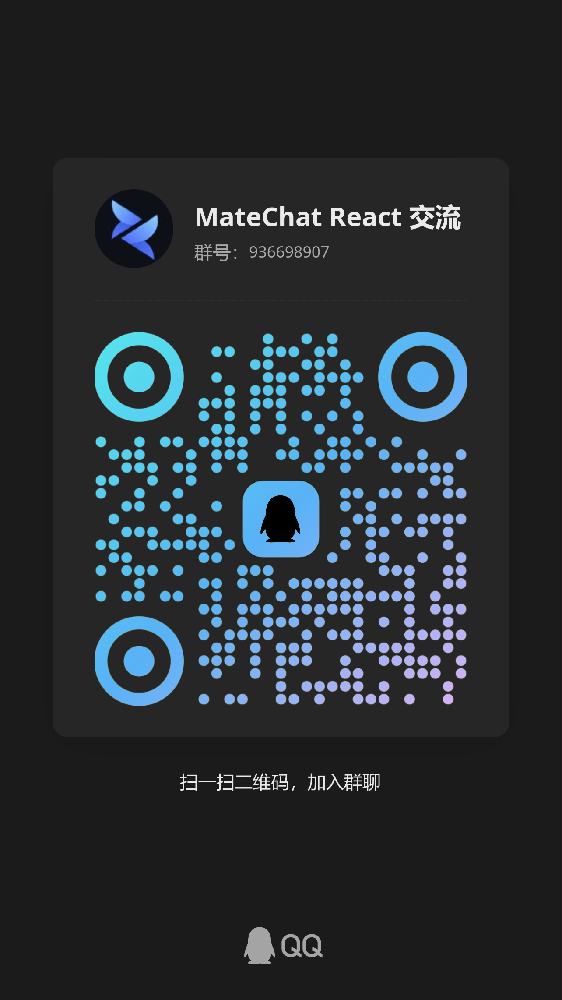

<div align="center">
  <h1>MateChat React</h1>
</div>

<div align="center">

MateChat React 是 [MateChat](https://github.com/DevCloudFE/MateChat) 的 React 版本，
它是一个基于华为 DevUI 设计的前端 AI 场景解决方案 UI 库。

[](https://www.npmjs.com/package/@matechat/react)
[](https://www.npmjs.com/package/@matechat/react)
[](./LICENSE)

</div>

<div align="center">

[English](./README.md) | 简体中文

</div>

---

## 介绍

**MateChat React** 是一个专为 AI 场景打造的 React 组件库，适用于聊天助手、提示工程工具、Agent 框架等场景。 这是 [MateChat](https://github.com/DevCloudFE/MateChat) 的 React 版本，保持一致的功能与风格。

MateChat 基于 [华为 DevUI Design](https://devui.design/)，提供现代视觉语言、一致的用户体验以及良好的可扩展性。

---

## 特性

- 🧠 为 AI 交互和提示工程设计
- 🎨 基于 DevUI 设计体系
- ⚛️ 完全基于 TypeScript 类型支持
- 🌗 内置浅色/深色主题切换
- 🔌 高度可定制与灵活性

---

## 快速开始

```bash
# npm
npm install @matechat/react

# or pnpm
pnpm add @matechat/react
```

```tsx
import { Bubble } from "@matechat/react";
import avatar from "./avatar.png";

export default function BubbleDemo() {
  return (
    <div className="bubble-chat">
      <div className="bubble-row left">
        
        <Bubble text="您好，请问有什么可以帮您？" />
      </div>
      <div className="bubble-row right">
        <Bubble text="我想了解一下产品功能！" />
        
      </div>
      <div className="bubble-row left">
        
        <Bubble text="好的，请稍等..." isPending />
      </div>
    </div>
  );
}
```

---

## 文档

文档仍在完善中，如果有任何疑问或建议，欢迎在 [GitCode](https://gitcode.com/DevCloudFE/MateChat/issues) 或 [GitHub](https://github.com/DevCloudFE/MateChat/issues) 提 issue。
由于项目仍在开发中，部分功能和文档可能会有调整。

可关注进展：[#4](https://github.com/DevCloudFE/matechat-react/issues/4) 和 [#5](https://github.com/DevCloudFE/MateChat/issues/5)。

---

## Star 趋势

[](https://www.star-history.com/#DevCloudFE/matechat-react&Date)

---

## 如何贡献

我们欢迎各种形式的贡献：

- 提交 bug 或需求 issue
- 创建 pull request
- 帮助完善文档或翻译

**贡献者：**

<a href="https://github.com/DevCloudFE/matechat-react/graphs/contributors">
  
</a>

---

## 联系我们

|                                              MateChat React 技术交流群                                               |                                         SOA 技术交流群                                         |
| :------------------------------------------------------------------------------------------------------------------: | :--------------------------------------------------------------------------------------------: |
| [](https://qm.qq.com/q/aMLehEXzBm) | [](https://qm.qq.com/q/lOocKriX74) |

---

## License

该项目已获得 [MIT 许可](./LICENSE).
